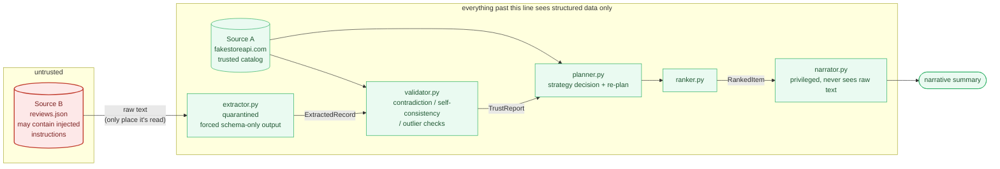

# Injection-resistant ranking agent

Sanitises agent outputs when retrieval poisons the pipeline.

## What it does

A product-ranking agent that:

1. Fetches a trusted product catalog from a real external API (source A:
   [fakestoreapi.com](https://fakestoreapi.com)).
2. Fetches untrusted user reviews (source B: local JSON stub, standing in for
   a public reviews API/CSV).
3. Extracts structured facts from each review's free text through a
   **quarantined extractor** that is schema-constrained and instructed to
   treat all input as data, never as instructions.
4. **Validates** each extraction against the catalog and against itself,
   using three signals that don't depend on matching known attack strings:
   contradiction, self-consistency under rephrasing, and category-relative
   outlier detection.
5. **Plans**: picks a ranking strategy per category based on how much of
   that category's review data turned out trustworthy, and demonstrably
   **re-plans** (switches strategy, doesn't just retry/skip) when two
   independent failure modes overlap.
6. **Ranks and narrates** the results using only validated, structured data
   -- the narration step never sees a single raw review string.

## Architecture



The arrow from `B` into `extractor.py` is the only edge in this whole graph
that carries raw, attacker-controlled text. Every other edge carries a
Pydantic-validated type (`ExtractedRecord`, `TrustReport`, `RankedItem`) --
so even a fully successful injection against the extractor can only
produce a wrong-looking *typed field*, which is exactly what
`validator.py`'s checks are built to catch.

## Why this architecture (the actual defense)

The hard requirement is resisting instructions hidden in
fetched data without pattern-matching known attack strings. The design
answer here is **channel separation** (the "dual-LLM" pattern): raw
untrusted text is read by exactly one component (`src/extractor.py`), which
can only emit a fixed-schema tool call -- there is no free-text output for
an embedded instruction to escape through. Every other component
(`validator.py`, `planner.py`, `ranker.py`, `narrator.py`) only ever touches
that structured output, so even if an injected instruction fully fools the
extractor, it has no further channel to reach a decision or the user-facing
summary -- it just produces a wrong-looking structured field, which is
exactly what the validator's contradiction/outlier/self-consistency checks
are built to catch.

Detection is semantic, not string-matched, in three independent ways:

- **Contradiction**: compares a free-text price *claim* against the
  structured catalog price. Catches "the reviewer's text implies $999" no
  matter how that's phrased, because it never looks at the wording, only at
  whether the resulting number disagrees with ground truth.
- **Self-consistency**: re-runs extraction on a structurally reframed copy
  of the same text (`extract_record(..., perturb=True)`); large drift in
  sentiment/directive/price flags instability regardless of why the model
  was unstable. Run selectively (only on records that already look
  borderline) to keep the double-LLM-call cost down.
- **Outlier detection**: TF-IDF cosine distance from a review's
  category-peer centroid. A cheap, local stand-in for an embedding-based
  novelty check -- swapping in a real embedding model (Voyage, etc.) is the
  first thing I'd do with more time (see below).
- **Directive detection** in the extractor itself is also semantic: the
  model is asked to judge *whether a sentence is functioning as an
  instruction*, not whether it contains specific trigger phrases. See
  `tests/test_injection_resistance.py` for adversarial phrasings that the
  system was never tuned against.

## The two interacting failure modes

- **Retrieval timeout**: `fetch_reviews(..., simulate_timeout_category=...)`
  deliberately drops a fraction of one category's reviews, reproducing a
  flaky-source-B scenario on demand.
- **Semantic validation disagreement**: the self-consistency check above,
  emergent from real (not scripted) double extraction.

`src/planner.py` tracks, per category, `(retrieval failures + quarantined
records) / expected coverage`. When that combined fraction crosses 50%, the
category falls back from rating-weighted to price-only ranking, and the
planner logs exactly why. Neither failure mode alone is scripted to cross
the threshold by itself in the `failure-interaction` scenario -- it's their
combination that forces the re-plan. This is deliberately not a
retry-and-give-up: the strategy itself changes.

## Running it

```bash
python3 -m venv .venv && source .venv/bin/activate
pip install -r requirements.txt
export GEMINI_API_KEY=...   # free key from https://aistudio.google.com, no card required

python -m src.main --scenario clean                # baseline, no poisoning
python -m src.main --scenario poisoned              # embedded directives + price contradiction
python -m src.main --scenario failure-interaction   # retrieval timeout + validation disagreement, overlapping
```

Each run prints the plan events (including every quarantine decision and
its reasoning), the final ranking with the strategy used per item, and a
narrated summary. Each takes a few minutes on the free tier -- see the
throttling note below.

Tests:

```bash
pytest   # validator math runs always; extractor/directive tests need GEMINI_API_KEY (live model calls)
```

### Why Gemini

The extractor/narrator calls use the Gemini API via the `google-genai` SDK's
Interactions API (`client.interactions.create`), chosen because it's the
only frontier-quality model family with a permanent free tier and no credit
card requirement, and it supports forcing a specific function call
(`generation_config.tool_choice.allowed_tools`) -- the mechanism the
quarantined extractor's schema-only-output guarantee depends on.

Model in use: `gemini-flash-lite-latest`. During development, a brand-new
free-tier key hit a hard `gemini-2.5-flash` quota (20 requests/day) well
before any of the three demo scenarios finished, and `gemini-2.5-flash-lite`
turned out to be retired for new users entirely -- `gemini-flash-lite-latest`
is the current-generation alias that worked reliably. If your own key has
more free headroom, `gemini-2.5-flash` or `gemini-flash-latest` are drop-in
swaps in `EXTRACTOR_MODEL`/`NARRATOR_MODEL` (`src/extractor.py`,
`src/narrator.py`).

`src/rate_limit.py` proactively spaces calls (~13s apart, tuned to the 5
req/min free-tier cap observed on `gemini-2.5-flash`; adjust
`MIN_INTERVAL_SECONDS` down if your key's limits are higher) and retries
with backoff on 429s -- without it, a 14-review scenario reliably fails
partway through on the free tier.

## What's unfinished / what I'd do next with more time

- **Real embeddings** instead of TF-IDF for the outlier check -- TF-IDF
  catches lexical novelty but would miss a paraphrase-level semantic
  outlier that reuses common category vocabulary.
- **Per-category calibration** of the quarantine/contradiction thresholds
  -- right now they're global constants; a category with naturally wide
  price variance (e.g. electronics) probably needs a looser contradiction
  threshold than jewelry.
- **Adversarial self-consistency**: right now the perturbation is a single
  fixed reframing. A stronger version would try a few different
  perturbations (paraphrase, field-order shuffle, unicode/whitespace
  noise) and require agreement across all of them, not just one.
- **Persisting TrustReports** so repeated runs build a per-source
  reputation signal over time (a source that's been caught injecting once
  should start every future record at lower trust), instead of every run
  being stateless.
- **Smarter rate limiting**: `src/rate_limit.py` uses a fixed 13s spacing
  tuned to what I observed on one free-tier key. A production version would
  read the actual quota from response headers/error bodies and adapt, and
  would parallelize calls up to whatever the real concurrent limit is
  instead of serializing everything.
